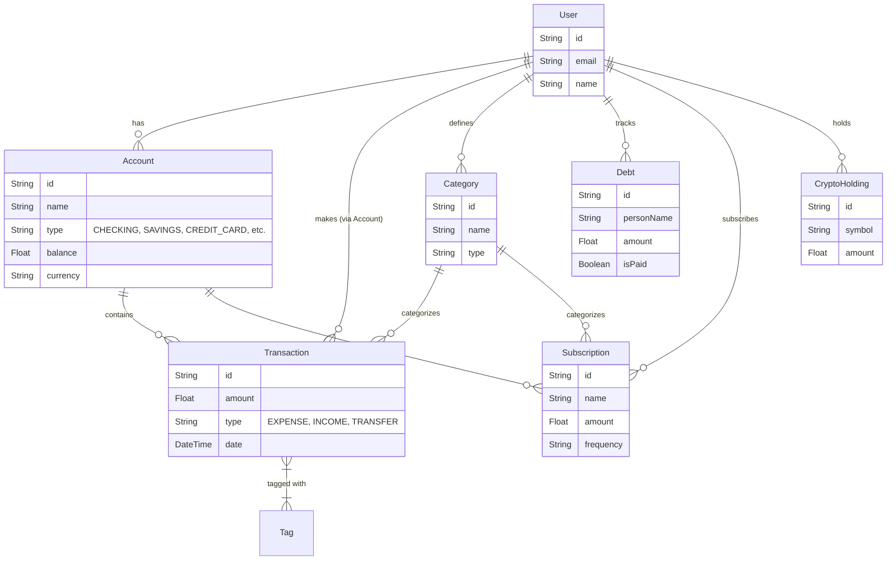

# Architecture Overview

This document provides a high-level overview of the Personal Finance Tracker's architecture.

## Tech Stack
- **Framework**: Next.js 16 (App Router)
- **Language**: TypeScript
- **Styling**: Tailwind CSS v4
- **Database**: PostgreSQL
- **ORM**: Prisma
- **Auth**: BetterAuth
- **State Management**: React Query (Server State), React Context (Client State)

## Database Schema

The following Entity-Relationship Diagram (ERD) represents the core data models.

## Folder Structure

- `src/app`: Next.js App Router pages and API routes.
    - `(auth)`: Authentication related pages (login, register).
    - `(dashboard)`: Protected dashboard pages.
    - `api`: Backend API endpoints.
- `src/lib`: Shared logic and utilities.
    - `domain`: Core business entities and logic (DDD-inspired).
    - `application`: Use cases and business rules.
    - `infrastructure`: Database repositories and external services.
- `src/components`: Reusable React components (shadcn/ui).
- `prisma`: Database schema and migrations.

## State Management Strategy
- **Server State**: Managed via `React Query` (TanStack Query). Data fetching, caching, and synchronization with the backend.
- **Client State**: Minimal global client state. React Context is used for UI state (e.g., Theme, Sidebar toggle).
- **Forms**: Managed via `react-hook-form` and validated with `zod`.
